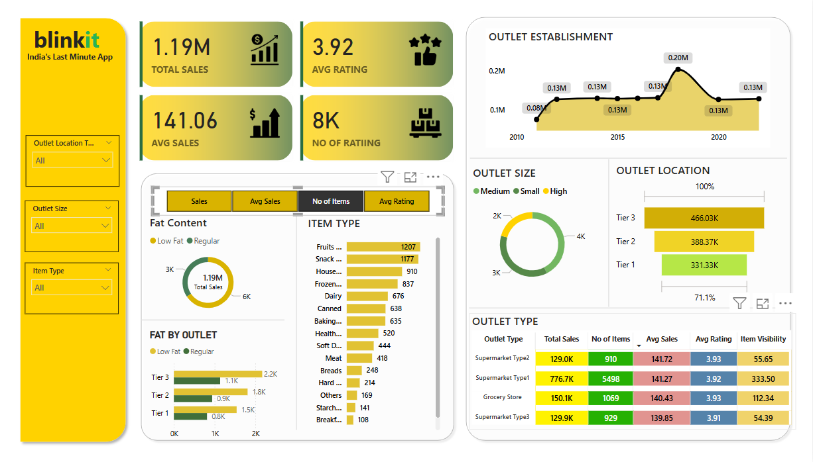

# 📊 Blinkit Sales Analysis using Power BI

This project showcases a **Power BI dashboard** developed for Blinkit's sales data to analyze sales performance, customer satisfaction, and inventory distribution.

##  Business Requirement

To conduct a **comprehensive analysis** of Blinkit’s performance and extract actionable insights using Power BI visualizations and DAX.

## 🔍 KPI Requirements

1. **Total Sales** – Overall revenue from items sold  
2. **Average Sales** – Average revenue per sale  
3. **Number of Items** – Count of different items sold  
4. **Average Rating** – Customer satisfaction score  

## 📊 Charting Requirements

1. **Sales by Fat Content** – Donut Chart  
2. **Sales by Item Type** – Bar Chart  
3. **Fat Content by Outlet** – Stacked Column Chart  
4. **Sales by Establishment Age** – Line Chart  
5. **Sales by Outlet Size** – Donut / Pie Chart  
6. **Sales by Location** – Funnel Map  
7. **All Metrics by Outlet Type** – Matrix Card

## 🔧 Project Workflow

- ✅ Requirement Gathering  
- ✅ Data Walkthrough  
- ✅ Data Connection  
- ✅ Data Cleaning & Quality Checks  
- ✅ Data Modeling  
- ✅ DAX Calculations  
- ✅ Chart Development & Formatting  
- ✅ Dashboard Building  
- ✅ Insights Generation  

## 📷 Screenshots

| Dashboard Preview | 
|-------------------|
|  

## 🛠 Tools & Tech

- Power BI  
- DAX  
- Data Modeling  
- Visualization Techniques

---

